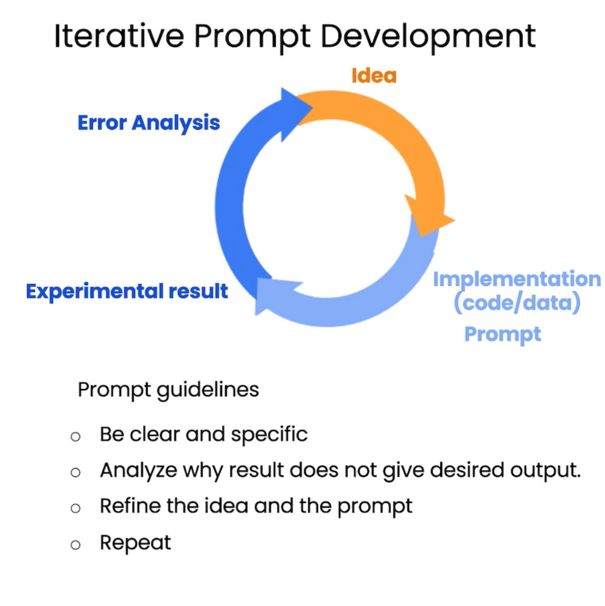

# [ChatGPT Prompt Engineering for Developers](https://learn.deeplearning.ai/chatgpt-prompt-eng/lesson/1/introduction)

- [ChatGPT Prompt Engineering for Developers](#chatgpt-prompt-engineering-for-developers)
  - [Open AI Enviroment Set-up](#open-ai-enviroment-set-up)
  - [Prompt Engineering Principles](#prompt-engineering-principles)
    - [Principle 1: Write clear and specific instructions](#principle-1-write-clear-and-specific-instructions)
      - [Tactic 1: Use delimiters to clearly indicate distinct parts of the input](#tactic-1-use-delimiters-to-clearly-indicate-distinct-parts-of-the-input)
      - [Tactic 2: Ask for a structured output: JSON, HTML, etc](#tactic-2-ask-for-a-structured-output-json-html-etc)
      - [Tactic 3: Ask the model to check whether conditions are satisfied](#tactic-3-ask-the-model-to-check-whether-conditions-are-satisfied)
      - [Tactic 4: "Few-shot" prompting](#tactic-4-few-shot-prompting)
    - [Principle 2: Give the model time to “think”](#principle-2-give-the-model-time-to-think)
      - [Tactic 1: Specify the steps required to complete a task](#tactic-1-specify-the-steps-required-to-complete-a-task)
      - [Tactic 2: Instruct the model to work out its own solution before rushing to a conclusion](#tactic-2-instruct-the-model-to-work-out-its-own-solution-before-rushing-to-a-conclusion)
  - [Iterative Prompt Development](#iterative-prompt-development)
  - [Tasks Example](#tasks-example)
    - [Text Summarize](#text-summarize)
    - [Infering](#infering)
      - [Sentiment Analysis](#sentiment-analysis)
      - [Infeering Topics](#infeering-topics)
      - [Transform (Text \& Data, include translation, grammar check, correction, etc)](#transform-text--data-include-translation-grammar-check-correction-etc)
      - [Expand](#expand)
    - [Example: Chatbot](#example-chatbot)
      - [the "roles" in Open AI API](#the-roles-in-open-ai-api)
      - [the orderBot Example](#the-orderbot-example)

## Open AI Enviroment Set-up

You need an (OpenAI) API key, store in .env file, then run

```py
import openai
import os
from IPython.display import display, Markdown, Latex, HTML, JSON

from dotenv import load_dotenv, find_dotenv
_ = load_dotenv(find_dotenv())

openai.api_key  = os.getenv('OPENAI_API_KEY')


def get_completion(prompt, model="gpt-3.5-turbo"):
    messages = [{"role": "user", "content": prompt}]
    response = openai.ChatCompletion.create(
        model=model,
        messages=messages,
        temperature=0, # this is the degree of randomness of the model's output
    )
    return response.choices[0].message["content"]
    
def get_completion_from_messages(messages, model="gpt-3.5-turbo", temperature=0):
    response = openai.ChatCompletion.create(
        model=model,
        messages=messages,
        temperature=temperature, # this is the degree of randomness of the model's output
    )
#     print(str(response.choices[0].message))
    return response.choices[0].message["content"]
```

## Prompt Engineering Principles

### Principle 1: Write clear and specific instructions

#### Tactic 1: Use delimiters to clearly indicate distinct parts of the input

Delimiters can be anything like: ```, """, < >, <tag> </tag>, :

```py
prompt = f"""
Summarize the text delimited by triple backticks \ 
into a single sentence.
```{text}```
"""
# chinese
prompt = f"""把用三个反引号括起来的文本总结成一句话。```{text}```"""

```

#### Tactic 2: Ask for a structured output: JSON, HTML, etc

You can limit the output length

```py
prompt = f"""
Generate a list of three made-up book titles along \ 
with their authors and genres. 
Provide them in JSON format with the following keys: 
book_id, title, author, genre.
"""

prompt = f"""请生成包括书名、作者和类别的三本虚构书籍清单，\
并以 JSON 格式提供，其中包含以下键:book_id、title、author、genre。"""
```

#### Tactic 3: Ask the model to check whether conditions are satisfied

```py
prompt = f"""
You will be provided with text delimited by triple quotes. 
If it contains a sequence of instructions, \ 
re-write those instructions in the following format:

Step 1 - ...
Step 2 - …
…
Step N - …

If the text does not contain a sequence of instructions, \ 
then simply write \"No steps provided.\"

\"\"\"{text_1}\"\"\"
"""
```

#### Tactic 4: "Few-shot" prompting

```py
prompt = f"""
Your task is to answer in a consistent style.

<child>: Teach me about patience.

<grandparent>: The river that carves the deepest \ 
valley flows from a modest spring; the \ 
grandest symphony originates from a single note; \ 
the most intricate tapestry begins with a solitary thread.

<child>: Teach me about resilience.
"""
response = get_completion(prompt)
print(response)
```

### Principle 2: Give the model time to “think”

#### Tactic 1: Specify the steps required to complete a task

```py
# example 1
prompt_1 = f"""
Perform the following actions: 
1 - Summarize the following text delimited by triple \
backticks with 1 sentence.
2 - Translate the summary into French.
3 - List each name in the French summary.
4 - Output a json object that contains the following \
keys: french_summary, num_names.

Separate your answers with line breaks.

Text:
```{text}```
"""

# Ask for output in a specified format
prompt_2 = f"""
Your task is to perform the following actions: 
1 - Summarize the following text delimited by 
  <> with 1 sentence.
2 - Translate the summary into French.
3 - List each name in the French summary.
4 - Output a json object that contains the 
  following keys: french_summary, num_names.

Use the following format:
Text: <text to summarize>
Summary: <summary>
Translation: <summary translation>
Names: <list of names in Italian summary>
Output JSON: <json with summary and num_names>

Text: <{text}>
"""
response = get_completion(prompt_2)
print("\nCompletion for prompt 2:")
print(response)

```

#### Tactic 2: Instruct the model to work out its own solution before rushing to a conclusion

```py
prompt = f"""
Your task is to determine if the student's solution \
is correct or not.
To solve the problem do the following:
- First, work out your own solution to the problem. 
- Then compare your solution to the student's solution \ 
and evaluate if the student's solution is correct or not. 
Don't decide if the student's solution is correct until 
you have done the problem yourself.

Use the following format:
Question:
'''
question here
'''
Student's solution:
'''
student's solution here
'''
Actual solution:
'''
steps to work out the solution and your solution here
'''
Is the student's solution the same as actual solution \
just calculated:
'''
yes or no
'''
Student grade:
'''
correct or incorrect
'''

Question:
'''
I'm building a solar power installation and I need help \
working out the financials. 
- Land costs $100 / square foot
- I can buy solar panels for $250 / square foot
- I negotiated a contract for maintenance that will cost \
me a flat $100k per year, and an additional $10 / square \
foot
What is the total cost for the first year of operations \
as a function of the number of square feet.
'''
Student's solution:
'''
Let x be the size of the installation in square feet.
Costs:
1. Land cost: 100x
2. Solar panel cost: 250x
3. Maintenance cost: 100,000 + 100x
Total cost: 100x + 250x + 100,000 + 100x = 450x + 100,000
'''
Actual solution:
"""

response = get_completion(prompt)
print(response)
```

## Iterative Prompt Development

- Iterative refinement of prompts is crucial in developing large language models applications.
- Initial prompt development involves drafting a basic version and gradually improving it through iterative adjustments. eg.
  - tune output limit,
  - specify output format, length, other requirements
- More complex applications benefit from iterative training across multiple samples to evaluate prompt performance averages.
- Detailed optimization across multiple datasets requires significant computational resources.
- Mastery of iterative prompt development and optimization techniques is essential for prompt engineers.
- Practical exercises in Jupyter Notebook enhance understanding of prompt iteration and optimization processes.


  



## Tasks Example

### Text Summarize

```py
from tool import get_completion

prompt = f"""
Your task is to generate a short summary of a product \
review from an ecommerce site to give feedback to the \
pricing deparmtment, responsible for determining the \
price of the product.  

Summarize the review below, delimited by triple 
backticks, in at most 30 words, and focusing on any aspects \
that are relevant to the price and perceived value. 

Review: ```{prod_review}```
"""

response = get_completion(prompt)
print(response)
```

```py
# Try "extract" instead of "summarize
prompt = 

reviews = [review_1, review_2, review_3, review_4]

for i in range(len(reviews)):
    
    prompt = f"""
    Your task is to extract relevant information from \ 
    a product review from an ecommerce site to give \
    feedback to the Shipping department. 

    From the review below, delimited by triple quotes \
    extract the information relevant to shipping and \ 
    delivery. Limit to 30 words. 

    Review: ```{reviews[i]}```
    """
    response = get_completion(prompt)
    print(f"Review: {i+1}: ", response, "\n")
```

### Infering

#### Sentiment Analysis

```py
prompt = f"""
What is the sentiment of the following product review, 
which is delimited with triple backticks?

Give your answer as a single word, either "positive" \
or "negative".

Review text: '''{lamp_review}'''
"""

prompt = f"""
Identify a list of emotions that the writer of the \
following review is expressing. Include no more than \
five items in the list. Format your answer as a list of \
lower-case words separated by commas.

Review text: '''{lamp_review}'''
"""

## identify a sentiment (anger)
prompt = f"""
Is the writer of the following review expressing anger?\
The review is delimited with triple backticks. \
Give your answer as either yes or no.

Review text: '''{lamp_review}'''
"""

## identify objects and sentiment
prompt = f"""
Identify the following items from the review text: 
- Sentiment (positive or negative)
- Is the reviewer expressing anger? (true or false)
- Item purchased by reviewer
- Company that made the item

The review is delimited with triple backticks. \
Format your response as a JSON object with \
"Sentiment", "Anger", "Item" and "Brand" as the keys.
If the information isn't present, use "unknown" \
as the value.
Make your response as short as possible.
Format the Anger value as a boolean.

Review text: '''{lamp_review}'''
"""

```

#### Infeering Topics

```py
prompt = f"""
Determine five topics that are being discussed in the \
following text, which is delimited by triple backticks.

Make each item one or two words long. 

Format your response as a list of items separated by commas.

Text sample: '''{story}'''
"""

prompt = f"""
Determine whether each item in the following list of \
topics is a topic in the text below, which
is delimited with triple backticks.

Give your answer as list with 0 or 1 for each topic.\

List of topics: {", ".join(topic_list)}

Text sample: '''{story}'''
"""
```

#### Transform (Text & Data, include translation, grammar check, correction, etc)


```py
prompt = f"""
Translate the following  text to French and Spanish
and English pirate: \
```I want to order a basketball```
"""

prompt = f"""
Translate the following from slang to a business letter: 
'Dude, This is Joe, check out this spec on this standing lamp.'
"""
## Format Conversion
prompt = f"""
Translate the following python dictionary from JSON to an HTML \
table with column headers and title: {data_json}
"""

## grammar check 
prompt = f"""Proofread and correct the following text
    and rewrite the corrected version. If you don't find
    and errors, just say "No errors found". Don't use 
    any punctuation around the text:
    ```{t}```"""

## correction 
prompt = f"proofread and correct this review: ```{text}```"
prompt = f"""
proofread and correct this review. Make it more compelling. 
Ensure it follows APA style guide and targets an advanced reader. 
Output in markdown format.
Text: ```{text}```
"""
```

#### Expand

```py
prompt = f"""
You are a customer service AI assistant.
Your task is to send an email reply to a valued customer.
Given the customer email delimited by ```, \
Generate a reply to thank the customer for their review.
If the sentiment is positive or neutral, thank them for \
their review.
If the sentiment is negative, apologize and suggest that \
they can reach out to customer service. 
Make sure to use specific details from the review.
Write in a concise and professional tone.
Sign the email as `AI customer agent`.
Customer review: ```{review}```
Review sentiment: {sentiment}
"""
```

### Example: Chatbot

#### the "roles" in Open AI API

- System Role
  - What it does: Provides setup information or context, including instructions or guidelines.
  - When to use it: Sets the stage for the interaction, specifying rules or tone.
  - Example:
    - "The assistant should maintain a professional tone and avoid discussing politics."
- Assistant Role
  - What it does: Represents the model, responding to user inputs based on the system's context.
  - When to use it: Automatically assumed by the model when replying to user queries.
  - Example:
    - "To integrate OpenAI’s API with your Python application, start by installing the OpenAI Python package using pip..."
- User Role
  - What it does: Represents the human user, guiding the conversation and prompting responses.
  - When to use it: Used whenever the human user makes a statement or asks a question.
  - Example:
    - "Can you explain how to integrate OpenAI’s API with my Python application?"
- Why not just type everything in one big prompt?
  - Clarity and Structure: Keeps the conversation clear and structured.
  - Context Management: Separates different types of context (instructions vs. queries).
  - Control and Flexibility: Provides better control over the conversation's evolution.
  - Note: You’re guiding the model to respond appropriately, not training it directly.

Example:

```py
messages =  [  
{'role':'system', 'content':'You are an assistant that speaks like Shakespeare.'},    
{'role':'user', 'content':'tell me a joke'},   
{'role':'assistant', 'content':'Why did the chicken cross the road'},   
{'role':'user', 'content':'I don\'t know'}  ]
response = get_completion_from_messages(messages, temperature=1)
print(response)
```

#### the orderBot Example

```py
def get_completion(prompt, model="gpt-3.5-turbo"):
    messages = [{"role": "user", "content": prompt}]
    response = openai.ChatCompletion.create(
        model=model,
        messages=messages,
        temperature=0, # this is the degree of randomness of the model's output
    )
    return response.choices[0].message["content"]


def get_completion_from_messages(messages, model="gpt-3.5-turbo", temperature=0):
    response = openai.ChatCompletion.create(
        model=model,
        messages=messages,
        temperature=temperature, # this is the degree of randomness of the model's output
    )
#     print(str(response.choices[0].message))
    return response.choices[0].message["content"]

def collect_messages(_):
    prompt = inp.value_input
    inp.value = ''
    context.append({'role':'user', 'content':f"{prompt}"})
    response = get_completion_from_messages(context) 
    context.append({'role':'assistant', 'content':f"{response}"})
    panels.append(
        pn.Row('User:', pn.pane.Markdown(prompt, width=600)))
    panels.append(
        pn.Row('Assistant:', pn.pane.Markdown(response, width=600, style={'background-color': '#F6F6F6'})))
 
    return pn.Column(*panels)
    
import panel as pn  # GUI
pn.extension()

panels = [] # collect display 

context = [ {'role':'system', 'content':"""
You are OrderBot, an automated service to collect orders for a pizza restaurant. \
You first greet the customer, then collects the order, \
and then asks if it's a pickup or delivery. \
You wait to collect the entire order, then summarize it and check for a final \
time if the customer wants to add anything else. \
If it's a delivery, you ask for an address. \
Finally you collect the payment.\
Make sure to clarify all options, extras and sizes to uniquely \
identify the item from the menu.\
You respond in a short, very conversational friendly style. \
The menu includes \
pepperoni pizza  12.95, 10.00, 7.00 \
cheese pizza   10.95, 9.25, 6.50 \
eggplant pizza   11.95, 9.75, 6.75 \
fries 4.50, 3.50 \
greek salad 7.25 \
Toppings: \
extra cheese 2.00, \
mushrooms 1.50 \
sausage 3.00 \
canadian bacon 3.50 \
AI sauce 1.50 \
peppers 1.00 \
Drinks: \
coke 3.00, 2.00, 1.00 \
sprite 3.00, 2.00, 1.00 \
bottled water 5.00 \
"""} ]  # accumulate messages

inp = pn.widgets.TextInput(value="Hi", placeholder='Enter text here…')
button_conversation = pn.widgets.Button(name="Chat!")

interactive_conversation = pn.bind(collect_messages, button_conversation)

dashboard = pn.Column(
    inp,
    pn.Row(button_conversation),
    pn.panel(interactive_conversation, loading_indicator=True, height=300),
)

dashboard
```

```py
messages =  context.copy()
messages.append(
{'role':'system', 'content':'create a json summary of the previous food order. Itemize the price for each item\
 The fields should be 1) pizza, include size 2) list of toppings 3) list of drinks, include size   4) list of sides include size  5)total price '},    
)
 #The fields should be 1) pizza, price 2) list of toppings 3) list of drinks, include size include price  4) list of sides include size include price, 5)total price '},    

response = get_completion_from_messages(messages, temperature=0)
print(response)
```